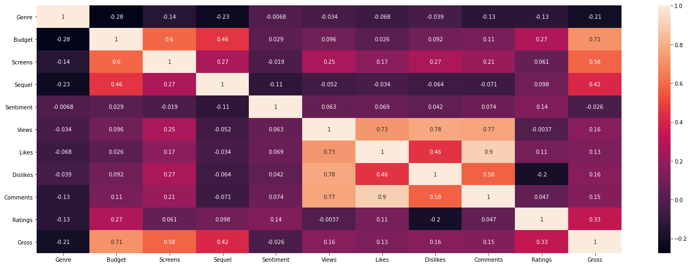

# Movie Gross Prediction from Conventional and Social Media Features

Can a movie's box-office gross be predicted from its budget, screen count and genre, plus social-media numbers like views, likes and comments? This notebook tries linear regression and random forests on 220 movies from 2014 and 2015, then turns the question into a classification task on net income.

## Dataset

[CSM (Conventional and Social Media Movies) Dataset 2014 and 2015](https://doi.org/10.24432/C5SP5T), M. Ahmed, UCI Machine Learning Repository. It has 231 movies and 14 attributes and is released under [CC BY 4.0](https://creativecommons.org/licenses/by/4.0/). It isn't committed here; `get_data.py` downloads it.

Rows with a missing *Budget* (1) or *Screens* (10) are dropped, which leaves 220. *Aggregate Followers* is missing for 35 movies, so the whole column goes instead of those rows. *Movie* and *Year* are dropped too.

## Method

- **Genre** is a number from 1 to 15, so it's binary-encoded into 4 columns rather than one-hot encoded into 15.
- **Scaling**: every feature is min-max normalized to [0, 1]. Without it, *Sequel* (1 to 7) would sit next to *Budget* (up to $250M).
- **Regression on Gross**: linear regression as the baseline, then a random forest (`max_depth=4`). Both are run twice, once on all 13 features and once on PCA components. PCA keeps the first 6 components, the smallest number that explains more than 90% of the variance.
- **Classification on Net** (*Gross* − *Budget*): movies are labeled by whether their net income is above the median, then SVM and logistic regression try to predict the label.

All models use one 70/30 train/test split with `random_state=42`.

## Results

Test-set scores, as saved in the notebook:

| Task | Model | All features | PCA (6 components) |
|---|---|---|---|
| Gross, R² | Linear regression | 0.542 | 0.589 |
| Gross, R² | Random forest | **0.739** | 0.645 |
| Net above median, accuracy | SVM | 0.621 | – |
| Net above median, accuracy | Logistic regression | 0.636 | – |

The random forest on all features does best. PCA helps linear regression a little and costs the random forest about 0.09 R². *Budget* and *Screens* are the features most correlated with *Gross*. Among the social-media features, *Views* moves with *Likes*, *Dislikes* and *Comments*.



These numbers are optimistic. The scaler and PCA were fitted before the split, so the test rows leaked into training (see below). With 220 movies and a single split, the second decimal can't be trusted either.

## Reproduce

Needs Python 3.8. The pinned versions are the ones the notebook was re-run with in 2026. Every score above came out the same, down to floating-point rounding.

```bash
py -3.8 -m venv .venv
.venv\Scripts\python -m pip install -r requirements.txt
.venv\Scripts\python get_data.py
.venv\Scripts\python -m jupyter nbconvert --to notebook --execute movie_gross_prediction.ipynb --output rerun.ipynb
```

`get_data.py` downloads the UCI archive and writes `dataset.csv` in the format the notebook reads (`;` separator, `,` decimal mark). scikit-learn has to stay below 1.2, because the notebook imports `plot_confusion_matrix`.

## Known limitations

Written as a student project; I would do some things differently today:

- The scaler and PCA are fitted on the whole dataset before the train/test split, so test statistics leak into training. Fitting them inside a `Pipeline` on the training fold only is the correct approach.
- With ~220 samples a single 70/30 split gives noisy scores; k-fold cross-validation would be more reliable.
- The notebook's text calls the regressors' score "precision" or "accuracy". It's actually R².
- Binary encoding of a nominal feature adds an artificial ordering between genres; one-hot encoding is safer with this few categories.
- The notebook says PCA reduces 10 features to 6. There are 13 input features.

## Status

Data Spaces course project, Politecnico di Torino, A.Y. 2019/20. Not maintained.
